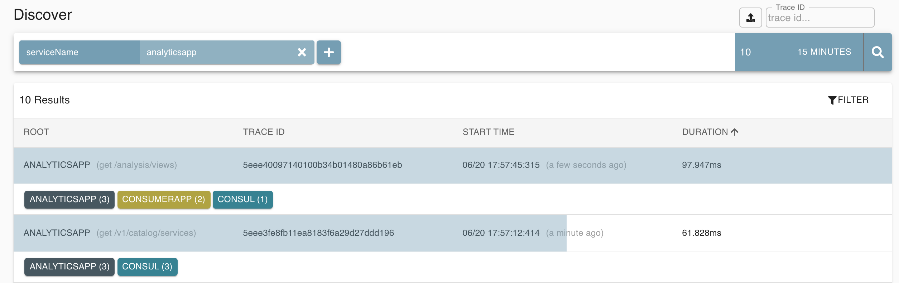

# Introduction
This repository provides a set of Docker containers and Java Microservices to get started with some hands-on learning. This Project aims to provide a conceptual implementation of various components of a Distributed System, such as: 

- Distributed, Asynchronous Processing
- Microservice Framework
- Service Discovery
- Distributed Tracing
- Distributed log Collection
- Application metrics, health monitoring
- Containerized Services

**Table Of Contents**
- [Introduction](#introduction)
- [Overview](#overview)
- [Technical Stack](#technical-stack)
- [Quick Setup](#quick-setup)
- [Applications](#applications)
  - [Domain Introduction](#domain-introduction)
  - [Micronaut Apps](#micronaut-apps)
    - [Producer app](#producer-app)
    - [Consumer app](#consumer-app)
    - [Analytics app](#analytics-app)
  - [Apache Kafka, Zookeeper](#apache-kafka-zookeeper)
  - [Consul](#consul)
  - [Zipkin](#zipkin)
  - [Grafana](#grafana)
  - [Prometheus](#prometheus)
  - [Loki, Promtail](#loki-promtail)
  - [Mongo DB, Mongo Express](#mongo-db-mongo-express)
- [Run/Debug Micronaut Apps](#rundebug-micronaut-apps)
  - [Run Apps individually](#run-apps-individually)
- [Run/Debug UI](#rundebug-ui)
- [Utility Scripts](#utility-scripts)


# Overview


# Technical Stack
**Microservice Framework:** Micronaut , JDK
**UI:** React, Typescript    
**Build Tools:** Gradle, Webpack
**Container:** Docker  , Docker Compose
**Stream Processing**: Apache Kafka

# Quick Setup
**Setup host file**
```sh
sudo vim /ets/hosts 
127.0.0.1 dockerhost 
```

**Build Micronaut Package**
```sh
./gradlew all
```

**Run all Containers**
Create and Start All Services  
```sh 
./docker-build-services.sh
```

**Create Grafana Datasources**
1. run `./utils/grafana-add-datasources.sh `
2. change the password, keep same as admin  -> `http://localhost:3000`

**Verify that all runs well!**
`docker-compose ps -a`

```
consul                docker-entrypoint.sh agent ...   Up      8300/tcp, 8301/tcp, 8301/udp, 8302/tcp, 8302/udp, 0.0.0.0:8500->8500/tcp, 8600/tcp, 8600/udp
grafana               /run.sh                          Up      0.0.0.0:3000->3000/tcp                                                                      
kafka                 start-kafka.sh                   Up      0.0.0.0:9092->9092/tcp, 0.0.0.0:9094->9094/tcp                                              
loki                  /usr/bin/loki -config.file ...   Up      0.0.0.0:3100->3100/tcp                                                                      
micronaut-analytics   java -Dcom.sun.management. ...   Up      0.0.0.0:8084->8084/tcp                                                                      
micronaut-consumer    java -Dcom.sun.management. ...   Up      0.0.0.0:8082->8082/tcp                                                                      
micronaut-producer    java -Dcom.sun.management. ...   Up      0.0.0.0:8080->8080/tcp                                                                      
mongodb               docker-entrypoint.sh mongod      Up      0.0.0.0:27017->27017/tcp                                                                    
mongoexpress          tini -- /docker-entrypoint ...   Up      0.0.0.0:8081->8081/tcp                                                                      
prometheus            /bin/prometheus --config.f ...   Up      0.0.0.0:9090->9090/tcp                                                                      
promtail              /usr/bin/promtail -config. ...   Up                                                                                                  
zipkin                /busybox/sh run.sh               Up      9410/tcp, 0.0.0.0:9411->9411/tcp                                                            
zookeeper             /bin/sh -c /usr/sbin/sshd  ...   Up      0.0.0.0:2181->2181/tcp, 22/tcp, 2888/tcp, 3888/tcp                  
```


# Applications
## Domain Introduction
This System imitates a simple Analytics Domain to demonstrate capabilities of the invidual applications.
Product View events, as generated by Site action, are Aggregate by time window before being provided as Analytical Charts.
The indivual aplications are summerized below with their purposes and functionality.

## Micronaut Apps
Micronaut Apps use the same code base in which features are distinguished by the Environment Variables passed to it.
The techincal details are provided coming sections.

### Producer app
This app:  
- Has a Kafka Producer which sends Product View feeds
- Exposes an Endpoint which receives the Product View feeds
- Provide a UI App which allows generating those events from a browser

Browse at: http://localhost:8082


### Consumer app
This app: 
- Has a Kafka Stream Processor which aggregates the Product Views by Product windowed by time
- Has a Kafka Consumer to read the Aggregated Product Views Data and write them to MongoDB Database 
- Exposes an Endpoint which provides Analytical Data with a Generic structure

### Analytics app
This app:
- Has a Consumer App using Service Discovery
- Fetches the Data from Consumer's Endpoint and convert into an Acceptable format by UI app
- Provide a UI app to view the Product View Analytical chart

Browse at: http://localhost:8084


## Apache Kafka, Zookeeper
Apache Kafka is used as a backend for supporting Micronaut apps for Distributed Stream processing.
Apache Kafka relies on Zookeeper which runs as a standalone appliaction.

## Consul
Consul provides Service Discovery feature among many others. All Micronaut apps register with Consul at start-up.
Micronaut Analytics app uses Service Discovery Client to find the address of the Consumer and then invoke it's Endpoint to fetch the data.


## Zipkin
All Micronaut Apps are configured with Zipkin. OOTB Zipkin is integrated with Client and Server side Http Requests, and also with Kafka Streams.
The TraceIDs of the Spans is present in the log file which is used to jump to the related trace.





## Grafana
Grafana is an analytics and monitoring solution. In this system Grafana relies on the Prometheus and Loki as datasource. 
Prometheus provides the required metrics from the Micronaut apps, and Loki provides the application Logs to it.

Sample Dashboard:


Can jump to trace directly from Grafana:


*Use `admin` as User ID and Password while logging into Grafana.*


## Prometheus
Prometheus is a System monitoring tool which collects metrics from Applications and acts as a source to Grafana.
Prometheus uses the Micronaut App endpoints to get the metrics of the apps relating to its Infrastructure and functionality.


## Loki, Promtail
Loki is a grafana supported Log aggregation system. Loki relies on the Promtail agents which has access to all Application logs using shared file Systems.
Promtail sends the logs to Loki which further acts as a source to Grafana.

## Mongo DB, Mongo Express
Its a widely used NoSQL DB which is used to store the Product View Analytics Data in JSON format.
Mongo Express app makes it easy to browse the DB graphically which can be useful to check and play with the data.


# Run/Debug Micronaut Apps
Micronaut provides Environemnt dependents Beans and Configurtaion which makes it easy to manage multiple veersion in the same code base.
The Beans are annotated as below:

```java
@Requires(env = "consumer") // OR
@Requires(env = "producer") // OR
@Requires(env = "analytics")
```
Additionally, the Cofiguration is maintained at per environment level. The application files simply follow this pattern: `application-<env>.yml`

## Run Apps individually
**Using Gradle**
```sh
export MICRONAUT_ENVIRONMENTS=producer && ./gradlew run
```
*--continuous* flag can also be used with Gradle to keep rebuilding on file changes.


**Using Jar file**
```sh
java -Dmicronaut.environments=producer -jar build/libs/micronautapp-1.0-all.jar
```


# Run/Debug UI
The UI uses webpack for a build tool and a common code base for Producer and Analytics apps.
Separate Entry point is configured for each of them.
Use `npm install` and `npm start` from 'ui' directory to run the webpack in Dev mode. 

*Webpack* will proxy the Producer and Analytics apps on port *8082* and *8084* respectively for necessairy URLs.


# Utility Scripts
**Docker**
Stop All Containers  :
`./docker-stop-services.sh`

Start All Containers:
`./docker-start-services.sh`

Build Containers / Start Afresh:
`./docker-build-services.sh`

Remove all Containers:
`./docker-remove-services.sh`

**Kafka**
Start a CLI with Kafka:
`./utils/kafka-cli.sh`

**Grafana**
Add datasources to Grafana:
`./utils/grafana-add-datasources.sh`