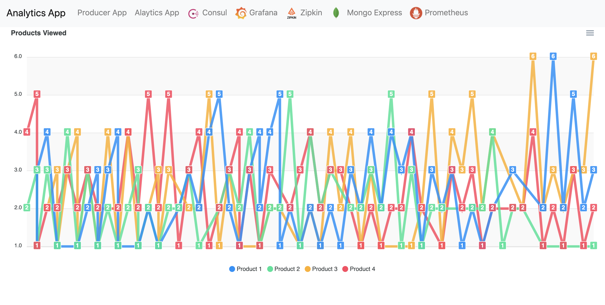
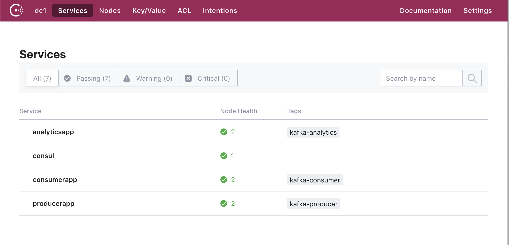

# Introduction
This repository provides a set of Docker containers and Java Microservices to get started with some hands-on learning. This Project aims to provide a conceptual implementation of various components of a Distributed System. 

- Distributed, Asynchronous Processing
- Microservice Framework
- Service Discovery
- Distributed Tracing
- Distributed log Collection
- Application metrics, health monitoring
- Containerized Services

**Table Of Contents**
- [Introduction](#introduction)
- [Overview](#overview)
- [Technical Stack](#technical-stack)
- [Quick Setup](#quick-setup)
- [Applications](#applications)
  - [Domain Introduction](#domain-introduction)
  - [Micronaut Apps](#micronaut-apps)
    - [Producer app](#producer-app)
    - [Consumer app](#consumer-app)
    - [Analytics app](#analytics-app)
  - [Apache Kafka, Zookeeper](#apache-kafka-zookeeper)
  - [Consul](#consul)
  - [Zipkin](#zipkin)
  - [Grafana](#grafana)
  - [Prometheus](#prometheus)
  - [Loki, Promtail](#loki-promtail)
  - [Mongo DB, Mongo Express](#mongo-db-mongo-express)
- [Run/Debug Micronaut Apps](#rundebug-micronaut-apps)
  - [Run Apps individually](#run-apps-individually)
- [Run/Debug UI](#rundebug-ui)
- [Utility Scripts](#utility-scripts)


# Overview


# Technical Stack
**Microservice Framework:** Micronaut , JDK
**UI:** React, Typescript    
**Build Tools:** Gradle, Webpack
**Container:** Docker  , Docker Compose
**Stream Processing**: Apache Kafka

# Quick Setup
**Set dockerhost as localhost**
```sh
sudo vim /ets/hosts 
127.0.0.1 dockerhost 
```

**Build Micronaut Package**
```sh
./gradlew all
```

**Create and run all Containers**
Create and Start All Services  
```sh 
./docker-build-services.sh
```

**Create Grafana Datasources**
1. run `./utils/grafana-add-datasources.sh `
2. change the password, keep same as admin  -> `http://localhost:3000`

**Verify that all runs well!**
.....

# Applications
## Domain Introduction
A very simple Analytics Domain is used to demonstrate capabilities of these applications.
The Objective at hand is to be able to produce some Product View events, Aggregate them within a time window, and generate the data for Charts to see the results.
This section will list details about each application with its role in this System.

## Micronaut Apps
Micronaut Apps use the same code base in which features are distinguished by the Environment Variables passed to it.
The techincal details are provided coming sections.

### Producer app
This app has the following responsibilities:  

- Provide a Kafka Producer which can send Product View feeds
- Provide an End Point which receives the Product View feeds
- Provide a UI App which allows generating those events easily

Browse at: http://localhost:8082


### Consumer app
This app has the following responsibilities:  
- Provide a Kafka Stream Processor which aggregates the Product Views by Product windowed by time
- Provide a Kafka Consumer to read the Aggregated Product Views Data and write them to MongoDB Database 
- Provid an End Point which can be used to get the Product Views Analytics data

### Analytics app
This app has the following responsibilities:  
- Fetch the Consumer App using Service Discovery
- Get the Data from End Point and convert into Acceotable format by UI app
- Provide a UI app to view the Product View Analytics data

Browse at: http://localhost:8084


## Apache Kafka, Zookeeper
Apache Kafka is used as a backend for supporting Micronaut apps for Distributed Stream processing.
Apache Kafka relies on Zookeeper which is run as in one of the Containers.

## Consul
This is a Service Discovery Application. All Micronaut apps use this to register themselves at the start.
Micronaut Analytics app uses this to find the address of the Consumer and then invoke it's End Point to fetch the data.



## Zipkin
All Micronaut Apps are configured with Zipkin. Micronaut has fantastic support for this and is also bound with the sl4j framework.
The TraceIDs of the spans is logged in the log file which can be used to point to the related trace.


## Grafana
This is an analytics & monitoring solution which relies on the Prometheus and Loki. 
Prometheus provides the required metrics from the Micronaut apps to it and Loki provides the Logs to it.

Sample Dashboard:


Can jump to trace directly from Grafana:


*Use `admin` as User ID and Password while logging into Grafana.*


## Prometheus
Its a System monitoring tool which is configured with all Micronaut apps.
Prometheus uses the Micronaut App endpoints to get the metrics of the apps relating to Infrastructure and functionality.


## Loki, Promtail
Loki is a grafana supported Log aggregation system. Loki relies on the Promtail agaents which has access to all Application logs.
Promtail sends the logs to Loki which further acts as a source to Grafana.

## Mongo DB, Mongo Express
Its a widely used NoSQL DB which this System use to store the Product View Analytics Data in JSON format.
Mongo Express app makes it easy to browse the DB graphically which is useful to check and play with the data.


# Run/Debug Micronaut Apps
Micronaut provides Environemnt dependents Beans and Configurtaion which makes it easy to manage multiple veersion in the same code base.
The Beans are annotated as below:

```java
@Requires(env = "consumer") // OR
@Requires(env = "producer") // OR
@Requires(env = "analytics")
```
Additionally, the Cofiguration is maintained at per environment level. The application files simply follow this pattern: `application-<env>.yml`

## Run Apps individually
**Using Gradle**
```sh
export MICRONAUT_ENVIRONMENTS=producer && ./gradlew run
```
*--continuous* flag can also be used with Gradle to keep rebuilding on file changes.


**Using Jar file**
```sh
java -Dmicronaut.environments=producer -jar build/libs/micronautapp-1.0-all.jar
```


# Run/Debug UI
The UI uses webpack for a build tool and a common code base for Producer and Analytics apps.
Separate Entry point is configured for each of them.
Use `npm install` and `npm start` from 'ui' directory to run the webpack in Dev mode. 

*Webpack* will proxy the Producer and Analytics apps on port *8082* and *8084* respectively for necessairy URLs.


# Utility Scripts
**Docker**
Stop All Containers  :
`./docker-stop-services.sh`

Start All Containers:
`./docker-start-services.sh`

Build Containers / Start Afresh:
`./docker-build-services.sh`

Remove all Containers:
`./docker-remove-services.sh`

**Kafka**
Start a CLI with Kafka:
`./utils/kafka-cli.sh`

**Grafana**
Add datasources to Grafana:
`./utils/grafana-add-datasources.sh`